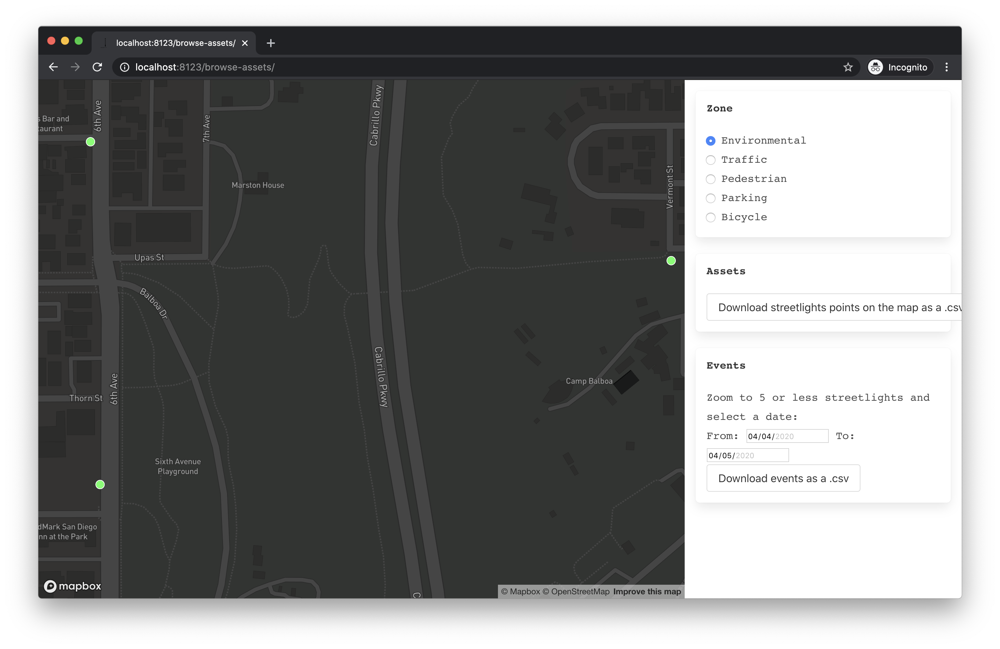

This is a small experiment to explore the "Current by GE CityIQ" API made available by San Diego to get information about the network of installed smart streetlights. More information (including the public credentials required to use the API) is available on [sandiego.gov](https://www.sandiego.gov/sustainability/energy-and-water-efficiency/programs-projects/smart-city).

The files in this folder constitute a small web app that displays smart streetlights on a map and allows for limiting downloading of streetlight data. It's a node.js + express app. To get it running, from a command line:
```
npm i
npm run start
```

Then visit http://localhost:8123 in your browser. You should see something similar to:


